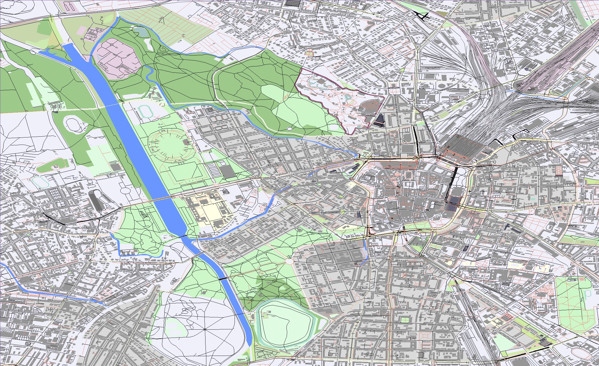

# MapViewer

This is a personal project where I try to parse OSM XML data and display it
in my custom built map renderer.

Map data comes from OpenStreetmap.

Pretty much all polygons in this map viewer are created by [Jonathan Richard Shewchuk](https://people.eecs.berkeley.edu/~jrs/)s 2D mesh generator library [Triangle](https://www.cs.cmu.edu/~quake/triangle.html).

A custom render of the city of Leipzig